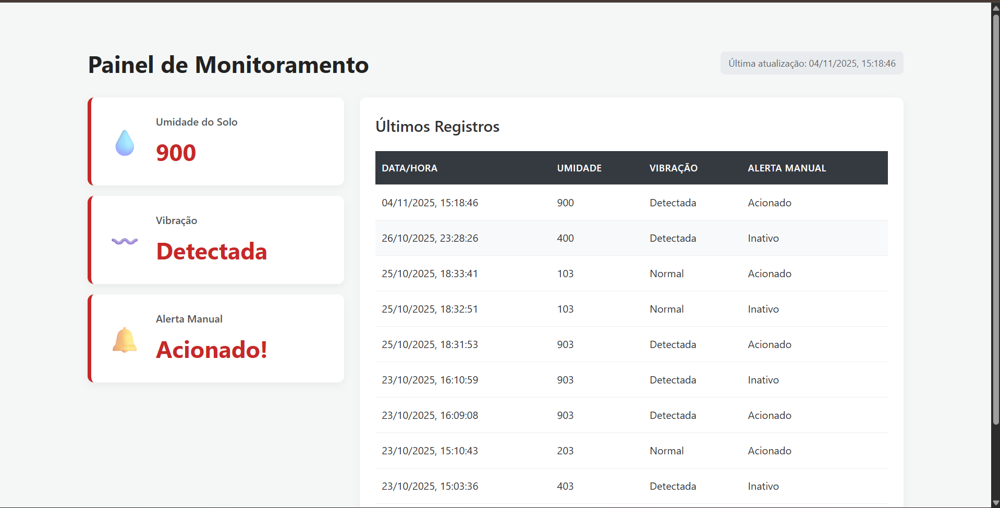

# IoT-PI

### Entre no TinkerCard: https://www.tinkercad.com/things/78XLOJyYiUB-sensor-de-deslizamento/editel?returnTo=https%3A%2F%2Fwww.tinkercad.com%2Fdashboard&sharecode=EIngOTVKE-p3g-p7n3jG1XPNodWXAjTmE4EoqgQrg8w

### Ligue o servidor pelo terminal com o comando "python servidor.py" e acesse o link que ele vai disponibilizar "127.0.0.1:5000"

### Depois inicie em outro terminal a Ponte com o comando "python ponte.py" E cole os dados do monitor serial do tinkercad na ponte

## Imagem do Dashboard

